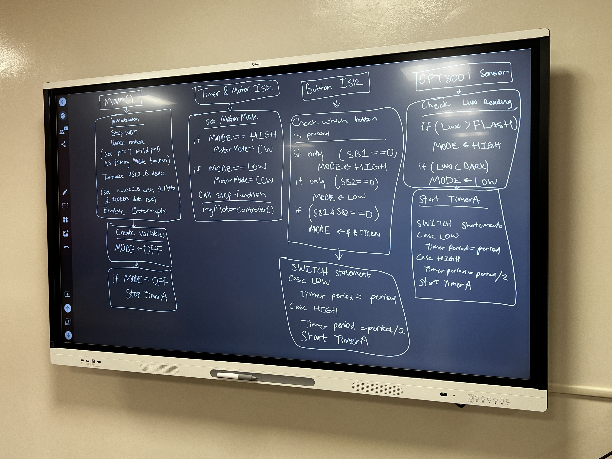

# Hybrid Stepper Motor Control - MSP430

**Lead Embedded Systems Developer:** Julian Montoya-Bedoya

Firmware in **Embedded C** for controlling a hybrid stepper motor with **I2C light sensor feedback** on the **MSP430FR5994**. Supports **LCD display**, **pattern mode**, and push-button/manual control.

---

## Features

- Hybrid stepper motor control (CW, CCW, pattern mode)  
- Light sensor (OPT3001) feedback  
- Push-button manual control  
- LCD display of motor status and step count  
- Timer-based step sequencing (Timer_A0)  
- Interrupt-driven design  

---

## Technical Overview

  

This diagram shows the **MSP430, LCD, OPT3001, and stepper motor architecture**.  

---

## System Demonstration

  

Click the image above to watch the **system demonstration video**.  

---

## Hardware

- MSP430FR5994 LaunchPad  
- Crystalfontz 128x128 ST7735 LCD  
- OPT3001 I2C Light Sensor  
- Bipolar Stepper Motor  
- Push-buttons  

---

## Setup

1. Install **Code Composer Studio (CCS)**.  
2. Open this project in CCS, ensure include paths point to `include/` and `lib/`.
3. (Optional) Connect your MSP430 LaunchPad if you want to flash the firmware.
4. Build and flash `src/main.c`.  

